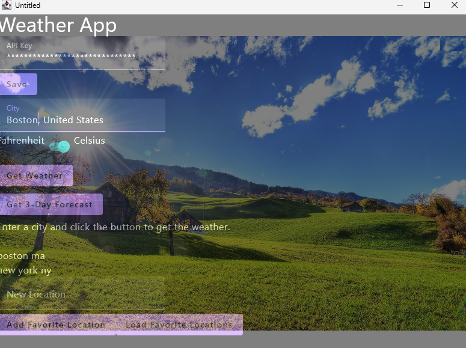

## Kotlin Weather App

This is a cross platform weather app made in Kotlin with Compose by Jetbrains. It uses weather data from your detected
location, or a location of your choice. The background is generated based on the weather forecast.

